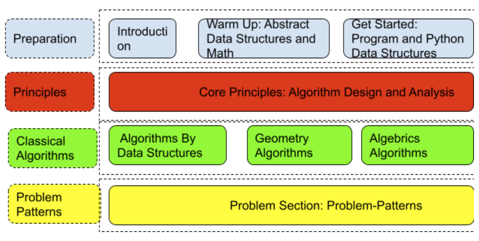

<div align="center">
<h1> Hands-on Algorithmic Problem Solving</h1>
<h3> A 100% open source one-stop coding interview prep book! </a> <h3>
<br> DSA · Python · LeetCode · Principles · Problem patterns<br>
</div>

<br>

<div align="center">
    <!-- <a target="_blank" href="https://www.liyinscience.com/"></a>&nbsp; -->
    <a target="_blank" href="https://github.com/liyin2015/python-coding-interview"></a>&nbsp;
    <a target="_blank" href="https://www.linkedin.com/in/li-yin-00b0456b/"></a>&nbsp;
    <a target="_blank" href="https://twitter.com/liyinscience"></a>
    <br>
    🔥&nbsp; Among the <a href="https://github.com/topics/algorithms-and-data-structures" target="_blank">top DSA</a> repositories on GitHub
</div>

<br>
<hr>

## Contributing
The book is written in latex, and all contents except the code is located under [**Easy-Book** folder](Easy-Book). Feel free to send me  [pull requests](https://github.com/liyin2015/python-coding-interview/pulls) to contribute contents. Before you start to improve the contents, it would be helpful to know the [high-level structure of the book](#about-this-book). Read [How to contribute?](how_to_contribute.md) for more details.

All contributors (with decent amount of contributions) will be listed as authors in the project.

<hr>


## About this book

<p align="center">
  
</p>


In short, this is a middle-to-high level algorithm book designed with cracking coding interviews at hearts. It offers a one-stop coding interview prep experience. The structure of the book: 
* **Preparation**: introduce the global picture of algorithmic problem solving and coding interviews, learn abstract data structures and highly related and useful math such as recurrence relation, and hands-on Python practice by relating the abstract data structures to Python data structures. *Coding is not just code after all.*, 
* **Principles**: we organize the design and principle here so that readers can use them as guidance while not seeking for peculiar algorithm for solving a problem. 
* **Classical algorithms**: We enhance our algorithm database via learning how to apply the core principles to a variety of classical problems. A database that we can quickly relate to when seeing problems.
* **Coding interview problem patterns**:  We close our book with the analyzing and categorizing problems by patterns. We address classical and best solutions for each problem pattern. 


Besides trying to make the content easy to follow, here summarizes the uniqueness of this book: (1) it offers Python source code that is tailored to be simple so that it would be natural for you to use in interviews (2) all the exercises and examples are from Leetcode problems so that you get to practise online (3) Classical algorithms are explained with design principles. No algorithm is magic. (Check out [advanced graph algorithms](https://github.com/liyin2015/Hands-on-Algorithmic-Problem-Solving/blob/master/chapters_pdf/chapter_advanced_graph_algorithm.pdf) as an example) (4) problem patterns to help you tackle coding interview questions topic by topic.
<hr>

## How did I come up with this book?
Preparing for the coding interview is not easy! Cracking the coding interview? Nearly impossible for most of us! Luck does play a role in the outcome. So, let's just treat it as a learning process and have some fun!

Computer Science is really not just computer science. It is a combination of all fields; our normal interview problems fall into the enumerative combinatorics and our computer vision mostly consists of Linear Algebra. What really matters is our passion to learn and the ability to apply this knowledge to solve real-life problems. 

There are plenty of books out there focusing on either teaching algorithmic knowledge  (*Introduction to Algorithms*, *Algorithmic Problem Solving*, etc) or introducing the interview process and solving interview problems(*Cracking the Coding Interview*, *Coding Interview Questions*, etc), but none of these books truly combine the two. This is a book designed to make up this role in the categorization. Principle, Pattern, and Leetcode Problems make up the core of this book.

This is **NOT** a book that provides hiring statistics for each company or gives the reader quick tricks in order to pass a few coding interviews.  Its purpose is to show you the beauty of algorithmic problem solving in the hope that you will be more passionate and confident about software engineering; the interview questions just set up a playground where we strengthen what we learn. 
<hr>

## For Readers
[The whole book](Easy-Book/main.pdf) is compiled as pdf.

For readers, you can read the book as a whole or read chapters selectively following the below links. 

## Table of Contents
<hr>

### Warm Up: Abstract Data Structures and Tools
* [Abstract Data Structures](chapters_pdf/Abstract_Data_Structures.pdf)
* Discrete Programming
* Recurrence Relation

### Get Started: Programming and Python Data Structures
* Iteration and Recursion
* Bit Manipulation
* [**Python Data Structures**](chapters_pdf/Python_Data_Structure.pdf)( [source code](Colab_Codes/chapter_python_datastrcutures.ipynb) )

### Core Principles: Algorithm Design and Analysis
* Complexity Analysis
* [Search Strategies](chapters_pdf/search_strategies.pdf)([source code: Graph Search](Colab_Codes/chapter_search_strategies.ipynb), [source code: Tree Traversal](Colab_Codes/chapter_tree_data_structure_and_traversal.ipynb))
* [Combinatorial Search](chapters_pdf/combinatorial_search.pdf)( [source code](Colab_Codes/chapter_combinatorial_search.ipynb))
* Reduce and Conquer

* **Decrease and Conquer**
> * [Binary Search, Binary Search Tree, and Segment Tree](chapters_pdf/decrease_and_conquer.pdf)( [source code](Colab_Codes/chapter_decrease_and_conquer.ipynb))
* [**Sorting and Selection**](chapters_pdf/sorting_algorithms_with_python3.pdf)( source code: [ sorting algorithms](Colab_Codes/chapter_sorting_and_selection_algorithms.ipynb),[ Python comparison and sort functions](Colab_Codes/chapter_python_comparison_sorting.ipynb))
* Dynamic Programming
* Greedy Algorithms

### Advanced Algorithms 
* Advanced Data Structures
* [**Advanced Search on Linear Data Structures**](chapters_pdf/advanced_search_on_linear_data_structures.pdf)( [source code](Colab_Codes/Advanced_Search_on_Linear_Data_Structures.ipynb))
* [Advanced Graph Algorithms](chapters_pdf/chapter_advanced_graph_algorithm.pdf)
* String Pattern Matches
* Math and Geometry Algorithms

### Problem Patterns
* Dynamic Programming Questions (15%)
* Array Questions (15%)
* Linked List, Stack, Queue, and Heap Questions (12%)
* String Questions (15%)
* [Tree Questions (10%)](unorganized_pdf/tree_questions.pdf)
* Graph Questions (15%)

*Note: everything is still in progress, so use it with caution.*
<hr>

## Referring Books and Materials

* Skiena, Steven S. The algorithm design manual: Text. Vol. 1. Springer Science & Business Media, 1998.

* T. H. Cormen, Introduction to algorithms, MIT press, 2009.

* Manber, Udi. Introduction to algorithms: a creative approach. Addison-Wesley Longman Publishing Co., Inc., 1989.

* Kleinberg, Jon, and Eva Tardos. Algorithm design. Pearson Education India, 2006.

* Russell, Stuart J., and Peter Norvig. Artificial intelligence: a modern approach. Malaysia; Pearson Education Limited,, 2016. (**Best book ever in explaining searching problem-solving, differentiate tree-search and graph-search**)

* D. M. Beazley, Python essential reference, Addison-Wesley Professional,2009.

* S. Halim and F. Halim, Competitive Programming 3, Lulu Independent
Publish, 2013.

* B. Slatkin, Effective Python: 59 Specific Ways to Write Better Python,Pearson Education, 2015.

* H. hua jiang, “Leetcode blogs,” https://zxi.mytechroad.com/blog/category, 2018, [Online; accessed 19-July-2018].

* B. Baka, “Python data structures and algorithms: Improve application performance with graphs, stacks, and queues,” 2017.

* “Competitive  Programming,”https://cp-algorithms.com/,  2019, [Online; accessed 19-July-2018].

* “cs  princeton,”https://aofa.cs.princeton.edu/60trees/,  2019,
[Online; accessed 19-July-2018]
* https://stanford-cs161.github.io/winter2021/schedule/
<hr>

## Tools
* Graph Visualize with [graphviz](http://www.webgraphviz.com/). [Examples](https://graphs.grevian.org/example). [Tutorial to use Python](https://graphviz.readthedocs.io/en/stable/manual.html)
<hr>

## Mocking Interviews
Practice is important. Schedule some mocking interviews with [interviewing.io](https://interviewing.io/). If you cant manage to register, you can join us in [discord server](https://discord.gg/ZXnSag7fMP) and ask peers for practice interview.
<hr>

## Community
**Join me on discord server: https://discord.gg/ZXnSag7fMP, for a supportive community**
<hr>

## Feedback
If you have ideas to improve the book, about formatting, more contents, or correct the errors, do not hesitate to let me know. 

<!-- Citation -->
To cite this content, please use:
<hr>
```bibtex
@misc{handsondsa,
    author       = {Li Yin},
    title        = {Hands-on Algorithmic Problem Solving},
    howpublished = {\url{https://github.com/liyin2015/python-coding-interview/}},
    year         = {2021}
}
```
